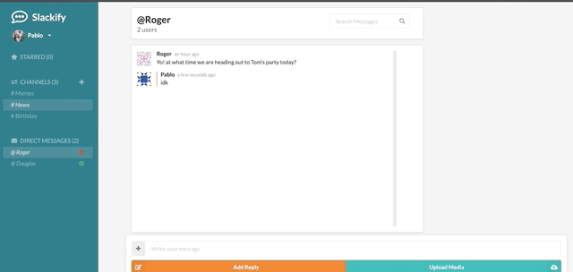
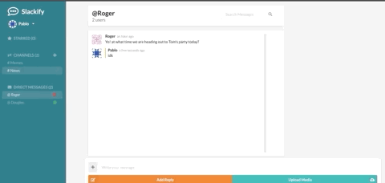
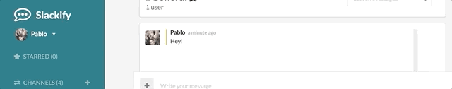

# Slackify

Totally not an attempt to make a clone of slack using React, Redux, and Firebase. Feel free to fork this project and add features.

Visit: https://slackify-26e73.web.app/

# Getting started

After you fork, download, or clone the repo, please execute the following commands to get the application to run locally:

```
npm install
npm install firebase
npm start
```

To access the application locally from your browser, visit:
```
localhost:3000
```
***

# Usage

With Slackify, you can create channels to share messages.




Chat with other users.


Add, upload, and modify media...




All on a real-time app!


